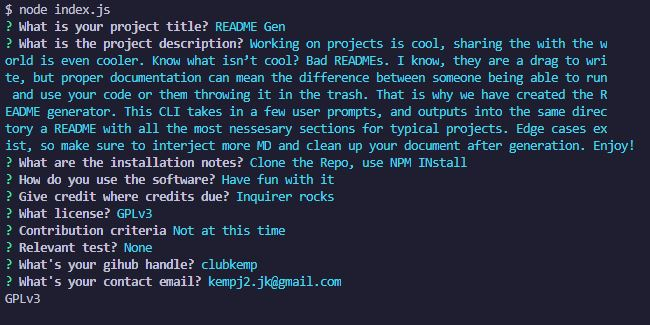

# README Markdown Generator
  
  
  ## Description 
  Working on projects is cool, sharing the with the world is even cooler. Know what isn’t cool? Bad READMEs. I know, they are a drag to write, but proper documentation can mean the difference between someone being able to run and use your code or them throwing it in the trash. That is why we have created the README generator. This CLI takes in a few user prompts, and outputs into the same directory a README with all the most nessesary sections for typical projects. Edge cases exist, so make sure to interject more MD and clean up your document after generation. Enjoy!

  
  
  ## Table of Contents
  * [Installation](#installation)
  * [Usage](#usage)
  * [Credits](#credits)
  * [License](#license)
  * [Contributions](#contributing)
  * [Tests](#tests)
  
  ## Installation 
  1.	Clone the repo using HTTPS 
  2. Make sure to get the needed dependencies using npm install
  
  ## Usage
  1. Run Node index.js 
  2. follow the prompts to create a new README
  3. The README is affixed with _staging, make sure to rename. Don't want to accidentally overwrite a perfectly good README
  
  [example video](https://drive.google.com/file/d/1FMUpBxNNU43qXx9lQuM3mr_wd--mOBst/view)
  
  ## Credits
  Thank's to the folks at Inquirer for giving us the tools we need to prompt
  
  ## License
  MIT
  
  ## Contributing
  Not accepting contributions at this time
  
  ## Tests
  None
  
  ## Questions
  Have quesitons about this repo? Please reach out on github or via email
  * [clubkemp](https://github.com/clubkemp)
  * kempj2.jk@gmail.com